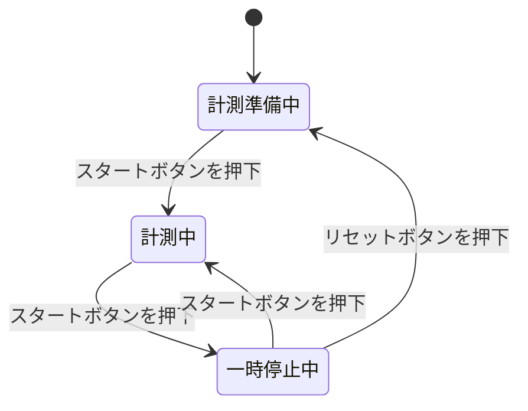

## ストップウォッチの動作

### 状態遷移図

```mermaid
stateDiagram-v2
  [*] --> 計測準備中
  計測準備中 --> 計測中 : スタートボタンを押下
  計測中 --> 一時停止中 : スタートボタンを押下
  一時停止中 --> 計測中 : スタートボタンを押下
  一時停止中 --> 計測準備中 : リセットボタンを押下
```

### 状態遷移表

||計測準備中|計測中|一時停止中|
|---|---|---|---|
|スタートボタンを押下|計測中|一時停止中|計測中|
|リセットボタンを押下|-|-|計測準備中|
