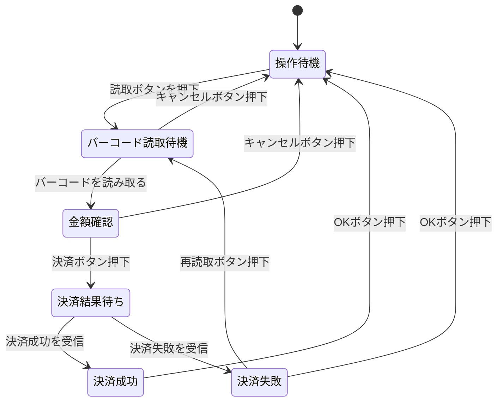

## スマホ決済アプリの決済処理

### 状態遷移図

### 状態遷移表

||操作待機|バーコード読取待機|金額確認|決済結果待ち|決済成功|決済失敗|
|---|---|---|---|---|---|---|
|読取ボタン押下|バーコード読取待機|-|-|-|-|-|
|バーコードを読み取る|-|金額確認|-|-|-|-|
|キャンセルボタン（バーコード読取待機）押下|-|操作待機|-|-|-|-|
|決済ボタン押下|-|-|決済結果待ち|-|-|-|
|キャンセルボタン（金額確認）押下|-|-|操作待機|-|-|-|
|決済成功を受信|-|-|-|決済成功|-|-|
|決済失敗を受信|-|-|-|決済失敗|-|-|
|OKボタン（決済成功）押下|-|-|-|-|操作待機|-|
|OKボタン（決済失敗）押下|-|-|-|-|-|操作待機|
|再読取ボタン押下|-|-|-|-|-|バーコード読取待機|

### すべての繊維を網羅するようなテストケース

1. 操作待機で読取ボタン押下 → バーコードを読み取る → 決済ボタン押下 → 決済成功を受信 → OKボタン押下
2. 操作待機で読取ボタン押下 → キャンセルボタン押下 → バーコードを読み取る → 決済ボタン押下 → 決済失敗を受信 → 再読取ボタン押下
3. 操作待機で読取ボタン押下 → バーコードを読み取る → 決済ボタン押下 → 決済失敗を受信 → OKボタン押下
4. 操作待機で読取ボタン押下 → バーコードを読み取る → キャンセルボタン押下

### 遷移前 x 遷移後の関係行列

||操作待機|バーコード読取待機|金額確認|決済結果待ち|決済成功|決済失敗|
|---|---|---|---|---|---|---|
|操作待機|-|a|-|-|-|-|
|バーコード読取待機|b|-|d|-|-|-|
|金額確認|c|-|-|e|-|-|
|決済結果待ち|-|-|-|-|f|g|
|決済成功|i|-|-|-|-|-|
|決済失敗|j|h|-|-|-|-|

|記号|トリガー|
|---|---|
|a|読取ボタン押下|
|b|キャンセルボタン（バーコード読取待機）押下|
|c|キャンセルボタン（金額確認）押下|
|d|バーコードを読み取る|
|e|決済ボタン押下|
|f|決済成功を受信|
|g|決済失敗を受信|
|h|再読取ボタン押下|
|i|OKボタン（決済成功）押下|
|j|OKボタン（決済失敗）押下|

### １スイッチカバレッジの表

||操作待機|バーコード読取待機|金額確認|決済結果待ち|決済成功|決済失敗|
|---|---|---|---|---|---|---|
|操作待機|ab|-|ad|-|-|-|
|バーコード読取待機|dc|ba|-|de|-|-|
|金額確認|-|ca|-|-|ef|eg|
|決済結果待ち|fi+gj|gh|-|-|-|-|
|決済成功|-|ia|-|-|-|-|
|決済失敗|hb|ja|hd|-|-|-|
