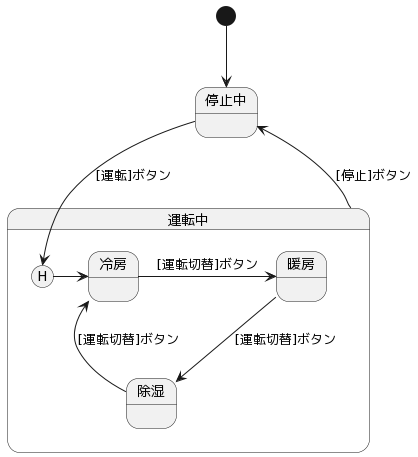

## エアコンの運転モード切替

### 状態遷移図

### 状態遷移表

||停止中|停止中（冷房）|停止中（暖房）|停止中（除湿）|冷房運転中|暖房運転中|除湿運転中|
|---|---|---|---|---|---|---|---|
|運転ボタン押下|冷房運転中|冷房運転中|暖房運転中|除湿運転中|-|-|-|
|停止ボタン押下|-|-|-|-|停止中（冷房）|停止中（暖房）|停止中（除湿）|
|運転切替ボタン押下|-|-|-|-|暖房運転中|除湿運転中|冷房運転中|

### テストケース

C1カバレッジ（遷移網羅）、および遷移しない無効トリガー動作。

|No|状態|トリガー|結果|
|---|---|---|---|
|1|停止中|運転ボタン押下|冷房運転中に遷移する|
|2|停止中|停止ボタン押下|遷移しない|
|3|停止中|運転切替ボタン押下|遷移しない|
|4|停止中（冷房）|運転ボタン押下|冷房運転中に遷移する|
|5|停止中（冷房）|停止ボタン押下|遷移しない|
|6|停止中（冷房）|運転切替ボタン押下|遷移しない|
|7|停止中（暖房）|運転ボタン押下|暖房運転中に遷移する|
|8|停止中（暖房）|停止ボタン押下|遷移しない|
|9|停止中（暖房）|運転切替ボタン押下|遷移しない|
|10|停止中（除湿）|運転ボタン押下|除湿運転中に遷移する|
|11|停止中（除湿）|停止ボタン押下|遷移しない|
|12|停止中（除湿）|運転切替ボタン押下|遷移しない|
|13|冷房運転中|運転ボタン押下|遷移しない|
|14|冷房運転中|停止ボタン押下|停止中（冷房）に遷移する|
|15|冷房運転中|運転切替ボタン押下|暖房運転中に遷移する|
|16|暖房運転中|運転ボタン押下|遷移しない|
|17|暖房運転中|停止ボタン押下|停止中（暖房）に遷移する|
|18|暖房運転中|運転切替ボタン押下|除湿運転中に遷移する|
|19|除湿運転中|運転ボタン押下|遷移しない|
|20|除湿運転中|停止ボタン押下|停止中（除湿）に遷移する|
|21|除湿運転中|運転切替ボタン押下|冷房運転中に遷移する|
